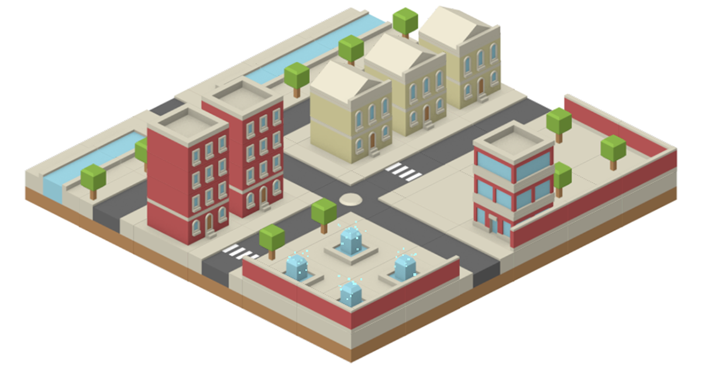
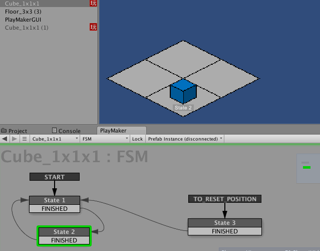
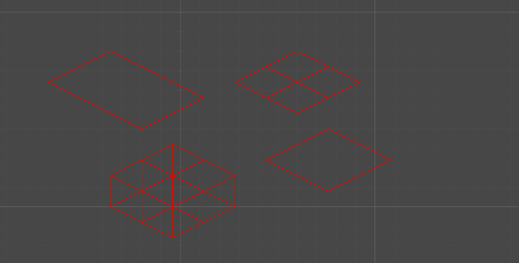
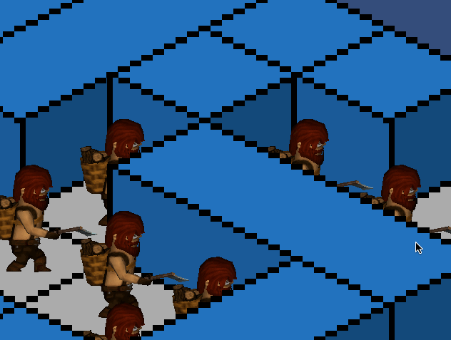
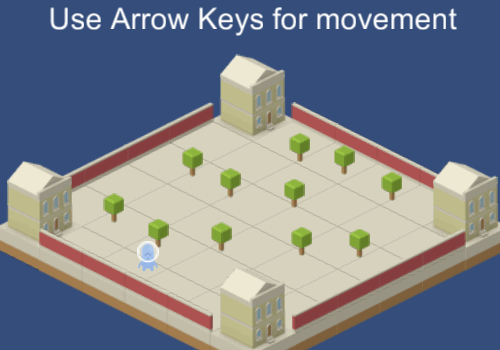
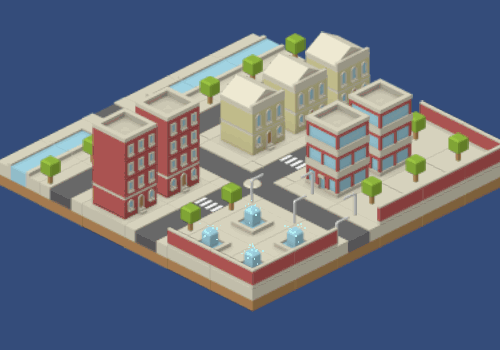
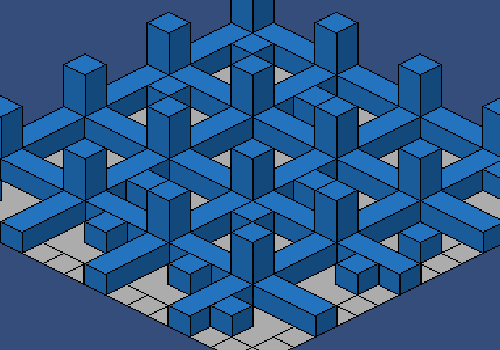
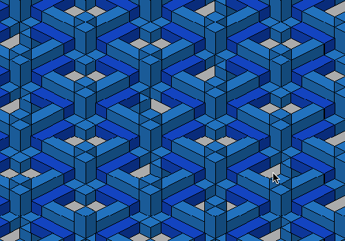

# Isometric 2.5D Toolset

[Asset Store](https://assetstore.unity.com/packages/tools/sprite-management/isometric-2-5d-toolset-27851) |
[Forum](https://forum.unity.com/threads/isometric-2-5d-toolset.291418/) |
[Web Demo](isometric-toolset/demo) |
[API Reference](isometric-toolset/api-reference.md) |
[Changelog](isometric-toolset/changelog.md)

## Features

- Automatic sorting 2D isometric tiles and objects
- Sorting objects with single-tile size as well as multiple-tiles size
- Auxiliary functions for converting isometric coordinates into screen coordinates and conversely
- Placing and snapping of objects in the Unity editor
- Physics support! (Colliders, Rigidbodies, Trigger and Collision events, Raycasts)
- Helpful mouse and touch functions
- Custom isometric tile angle, ratio and height
- Mix 2D and 3D support
- Full [PlayPaker](https://assetstore.unity.com/packages/tools/visual-scripting/playmaker-368) support

## Limitations

- Intersection of isometric objects is not allowed
- Parent-child related isometric objects is not allowed

## Usage videos

<iframe width="420" height="315" src="https://www.youtube.com/embed/IwJ_ofKG9_Y" frameborder="0" allowfullscreen></iframe>

<iframe width="420" height="315" src="https://www.youtube.com/embed/wmXhyDHXYcM" frameborder="0" allowfullscreen></iframe>

## Features

### PlayMaker Support

### Custom isometric tile angle, ratio and height

### Mix 2D and 3D support

## Preview samples

