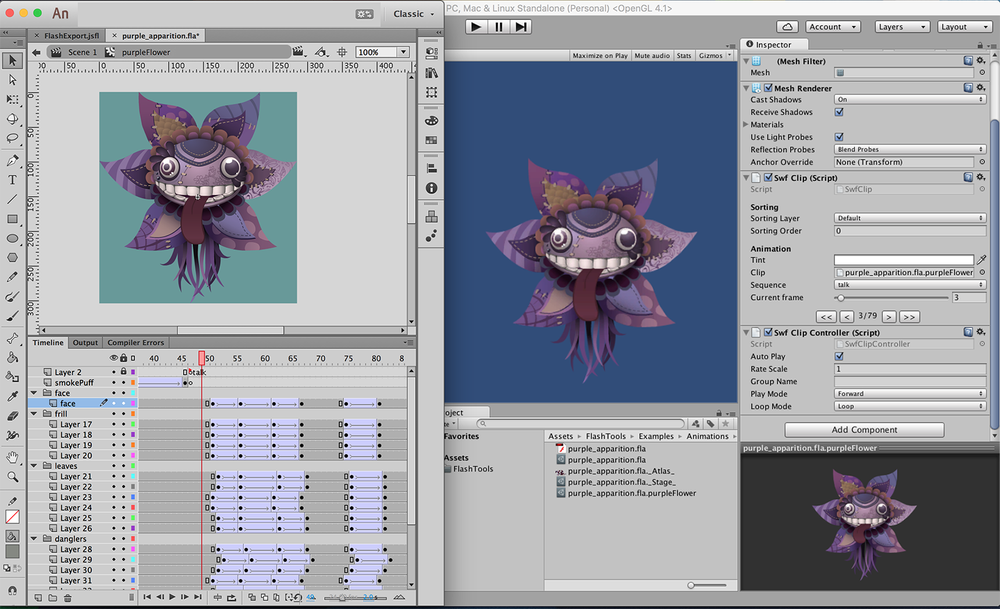
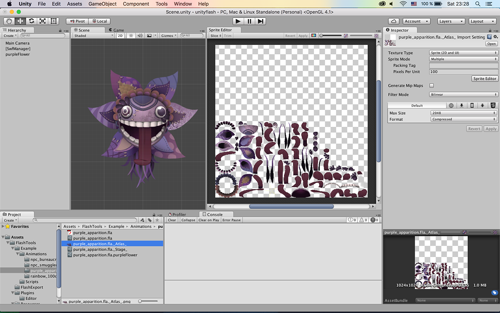
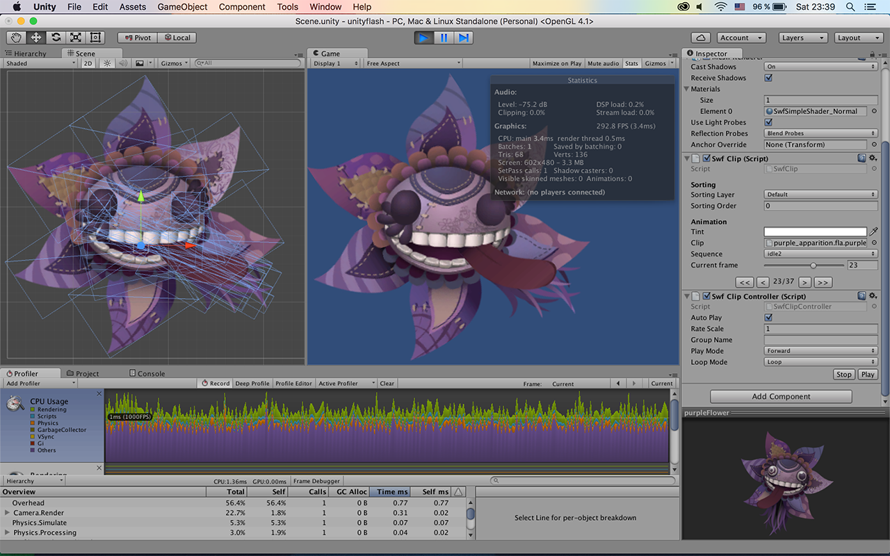

# Flash Animation Toolset

[Asset Store](https://assetstore.unity.com/packages/tools/animation/flash-animation-toolset-73323) |
[Forum](https://forum.unity.com/threads/1-3-15-flash-animation-toolset.440085) |
[Web Demo](flash-animation-toolset/demo) |
[User Guide](flash-animation-toolset/user-guide.md) |
[API Reference](flash-animation-toolset/api-reference.md) |
[Changelog](flash-animation-toolset/changelog.md)

## Features

- Support all transformations like 'rotation', 'skew' and 'scale' (except 3D)
- Support all tweens(classic, motion and etc), keyframes and layers
- Support mask layers
- Support bitmap and vector graphics
- Support all clip color effects like 'brightness', 'tint', 'alpha' and etc
- Support most blending modes (all except Alpha and Erase)
- Simple runtime API for controlling your animations in Unity
- Automatic packing texture atlases of animations with different settings
- Great performance with zero allocations in update loop
- Frame labels to separate sequences in one timeline
- Export marked "for export" clips and main timeline
- Live preview of animations in the Unity editor

## Usage video

<iframe width="420" height="315" src="https://www.youtube.com/embed/uE_XRWZ5KHA" frameborder="0" allowfullscreen></iframe>

## Screenshots

